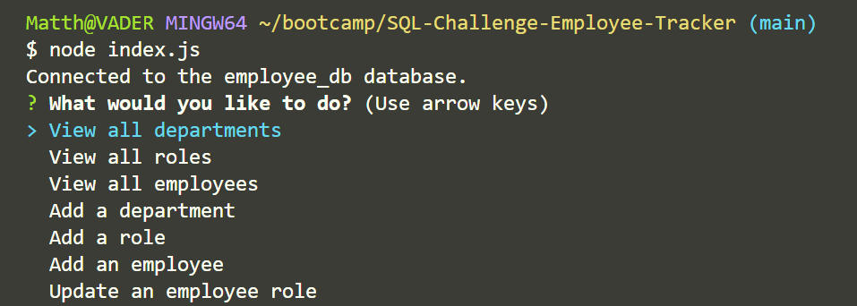
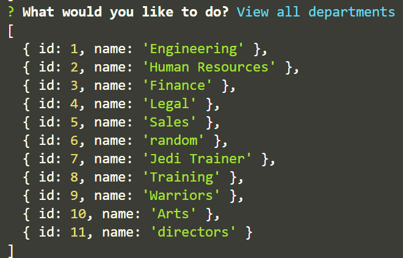
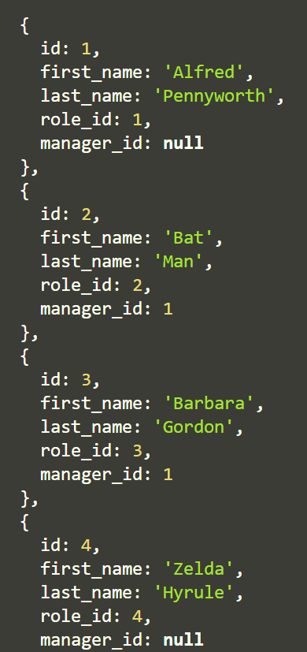
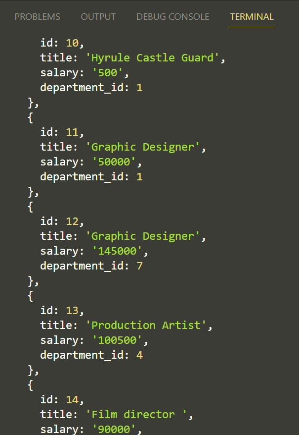

# SQL-Challenge-Employee-Tracker

  ## Table of Contents 
  - [Description](#description)
  - [Installation](#installation)
  - [Usage](#usage)
  - [Contribution](#contribution)
  - [Questions](#questions)
  - [License](#license) 

  ## Description
  Build a command-line application from scratch to manage a company's employee database, using Node.js, Inquirer, and MySQL.

  ## Installation 
  Make sure to install mysql2 and inquirer 8.2.4

  ## Usage 
  This is a CLI app, so open the terminal and type "node index.js" to run the program. It would also be helpful to have workbench installed to display any changes in "employee_db"

Here is a video link breaking down the code and showing the application running: 
https://drive.google.com/file/d/1TiPXL7CX535xgPipZis7T-0ezyYYotvT/view

Here is a screen shot of the main menu of the app: 

Here is a screenshot of the departments: 

Here is a screenshot of the employees:

Here is a screenshot of the roles: 

  ## Contribution 
  N/A

  ## Questions 
  - Github: [mrartrager] (https://github.com/mrartrager)
  - Email: [matthew.d.waldron@gmail.com] (Email: matthew.d.waldron@gmail.com)

  ## License
  MIT, 
  - 
  
